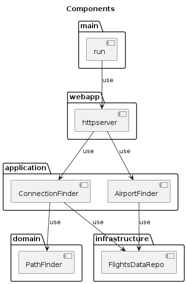
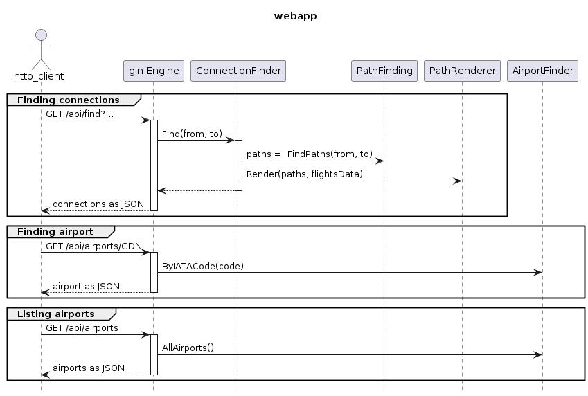

# Flight Finder

Find flight connections between two given airports:  
- Using OpenAPI3 + go-gin-server generator.  
- Using gin-gonic web framework.   
- Using Redis for connections cache
- Using AWS CloudWatch for metrics:
  - this requires `cloudwatch:PutMetricData` IAM permission assigned on your machine/EC2 or no metrics will be sent
  - if configured correctly, generates metrics in `FlightFinder` CloudWatch Merics namespace

## Run locally from source (with connections cache)

```sh
./redis_cache/run_redis_cache.sh &  
go run cmd/finder_web/main.go -port=8080 -flights_data=./assets -web_data=./web -aws_region=us-east-1 -redis_addr=localhost:6379 -redis_pass=CACHE
```

## Run locally with docker (without connections cache)

```sh
docker build . -t mateuszmidor/flight-finder:latest
docker run --rm --name=flight-finder -p=8080:80 -v $HOME/.aws:/root/.aws mateuszmidor/flight-finder:latest
```

## Run locally as systemd service

```sh
sudo cp init/flight-finder.service /etc/systemd/system/
sudo systemctl daemon-reload 
sudo systemctl enable flight-finder
sudo systemctl start flight-finder
sudo systemctl status flight-finder
```

## Run on AWS EC2 or similar

```sh
#!/usr/bin/env sh

# install docker
curl -fsSL https://get.docker.com | sh

# install systemd service
cat << EOF > /etc/systemd/system/flight-finder.service
[Unit] 
Description=Flight Finder Web Server 
After=network.target 

[Service] 
Type=simple 
Restart=always  
ExecStart=docker run --rm --name=flight-finder -p=80:80 -v $HOME/.aws:/root/.aws mateuszmidor/flight-finder:latest
ExecStop=docker stop flight-finder 
                                   
[Install] 
WantedBy=multi-user.target
EOF

# run systemd service
systemctl daemon-reload    
systemctl enable flight-finder
systemctl start flight-finder
systemctl status flight-finder
```

## Run on AWS BeanStalk

- using platform GO  
    What BeanStalk does with your code uploaded as ZIP archive:
    - unzip the archive files
    - `go build application.go && ./application`
    - map host port 80 to application port 5000

    , so you just need to make a ZIP archive with the app and use it for creating BeanStalk application in AWS Console:

    ```sh
    zip -r flight-finder-platform_go-port5000-v1.zip assets/airports.csv.gz assets/nations.csv.gz assets/segments.csv.gz go.mod go.sum web/ pkg/ cmd/ application.go
    ```
- using platform Docker  
    What BeanStalk does with your code uploaded as ZIP archive:
    - unzip the archive files
    - `docker build . -t server`
    - `docker run -p=80:80 server`

    , so you just need to make a ZIP archive with the app and use it for creating BeanStalk application in AWS Console:
    ```sh
    zip -r flight-finder-platform_docker-port80-v1.zip assets/airports.csv.gz assets/nations.csv.gz assets/segments.csv.gz go.mod go.sum web/ scripts/ api/ pkg/ cmd/ Dockerfile
    ``` 

## Deploy using AWS CodeDeploy

- first setup variables in the script, then:
    ```sh
    ./aws_codedeploy/deploy.sh
    ```


## Enable AWS X-Ray

Attach IAM Policy `AWSXRayDaemonWriteAccess` to EC2 Instance Profile, then install&run xray daemon on EC2 instance, and run with `-aws_xray=true`

```sh
curl https://s3.us-east-2.amazonaws.com/aws-xray-assets.us-east-2/xray-daemon/aws-xray-daemon-3.x.rpm -o /home/ec2-user/xray.rpm
sudo yum install -y /home/ec2-user/xray.rpm
pgrep xray # check if xray is running
```
XRAY daemon:
- config: /etc/amazon/xray/cfg.yaml
- run command: /usr/bin/xray -f /var/log/xray/xray.log


Logs:
```log
2022-11-30T17:16:39Z [Info] Initializing AWS X-Ray daemon 3.3.5
2022-11-30T17:16:39Z [Info] Using buffer memory limit of 9 MB
2022-11-30T17:16:39Z [Info] 144 segment buffers allocated
2022-11-30T17:16:39Z [Info] Using region: us-east-1
2022-11-30T17:16:39Z [Info] HTTP Proxy server using X-Ray Endpoint : https://xray.us-east-1.amazonaws.com
2022-11-30T17:16:39Z [Info] Starting proxy http server on 127.0.0.1:2000
2022-11-30T18:39:50Z [Info] Successfully sent batch of 1 segments (0.029 seconds)
2022-11-30T18:40:21Z [Info] Successfully sent batch of 1 segments (0.012 seconds)
```


## API

- list all airports
    ```sh
    curl 'http://localhost:8080/api/airports'
    ```

- find connections
    ```sh 
    curl 'http://localhost:8080/api/find?from=gdn&to=sez&maxsegmentcount=2'
    ```

## Showcase

### 2-segments connection: Kraków-Las Palmas


### 3-segments connection: Kraków-Colombo


## Design

### Structure



### Sequence

